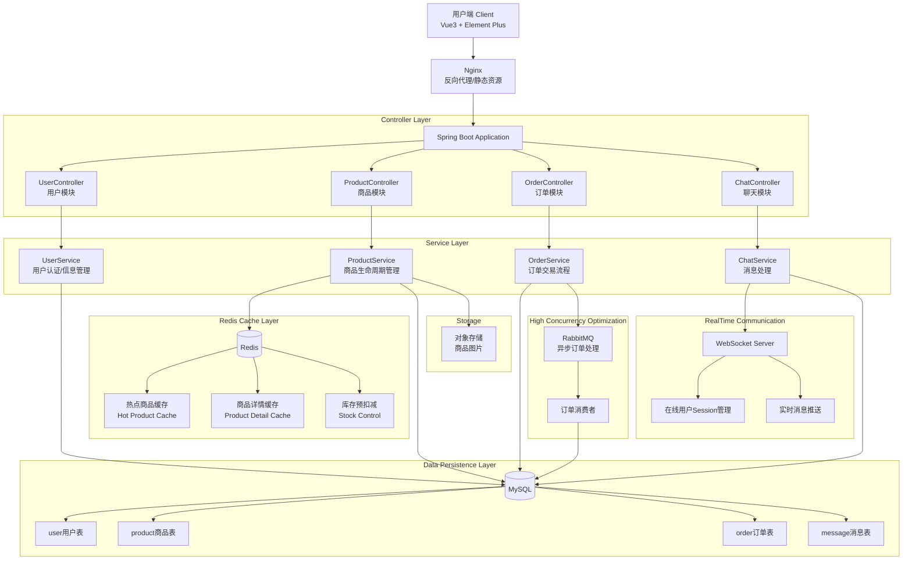
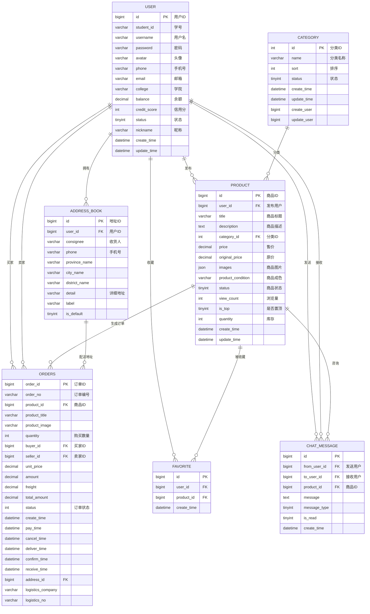
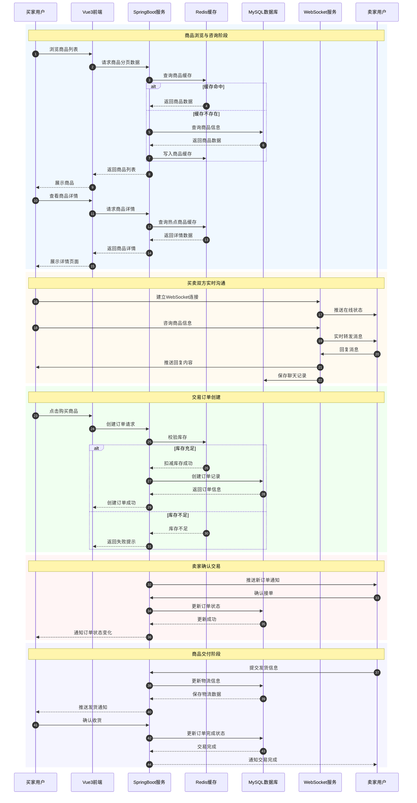

<div align="center">

  

  
  <h1>SwapU 云市集</h1>
  <p><b>一个采用前后端分离架构设计的云端市集平台</b></p>

  
  
  
  
  
  
  <div style="margin-top: 10px;">
    
    
    
    
    
  </div>
</div>

## 前言
本人是一个西安电子科技大学的计算机科学与技术专业的学生，这是我的第一个Spring Boot单体项目，希望通过完成这个项目来扎实自己的技术栈知识掌握程度以及编码调试能力，目前项目所有接口功能开发已经完成，正在做性能优化，例如高并发运用场景下的流量承压、热门商品的秒杀与库存预扣减等。
- 由于我主要学习后端，因而前端代码大部分由AI IDE完成，Bug调试和代码Review由本人全部完成。各位大佬请多多指教，问题可以在issue中反映，因为issue流程清晰可见。
- 后续将完成管理端业务功能、AI智能审核功能、AI优化传统推荐算法和AI客服助手功能，AI部分会设计Spring AI、LangChain4j、RAG等技术栈体系，本人将一边学习技术栈一边完成开发，并且不断完善和优化已有功能。

## 项目简介

对于在商圈或校园中传统的线下市集来说，信息杂乱不集中、交易不方便、商品流转流程不够规范且浪费公共资源是始终存在的痛点，而SwapU云市集平台则是为解决这些痛点而诞生的商品交易平台。

SwapU云市集，一个采用**前后端分离架构**设计的云端市集平台，前端使用 **Vue3 + Element Plus** 构建用户界面，后端采用 **Spring Boot** 框架实现业务逻辑处理。

为提高系统性能，使用 **Redis** 作为缓存中间件，实现热门商品以及库存信息缓存。使用 **JWT** 实现用户身份鉴权，采用拦截器校验用户Token。系统聊天模块采用 **WebSocket** 技术实现实时通信，支持买卖双方即时消息交互。同时通过**阿里云OSS**存储提供文件上传服务用于商品图片存储。整体架构具有良好的扩展性、可维护性和高并发处理能力。

## 功能特性
- 📱 **用户模块**：注册、登录、密码修改、个人信息管理、收藏管理
- 🛒 **商品模块**：发布、浏览、分类查询、编辑、下架、删除、热门推荐、分页查询
- 📋 **订单模块**：创建、支付、取消、确认接单、发货、确认收货、订单详情、订单统计
- 💬 **聊天模块**：实时消息、会话列表、历史消息、消息已读状态同步
- 📍 **地址模块**：收货地址管理（增删改查、默认地址设置）
- 🚀 **性能优化**：Redis缓存、库存预扣减、异步同步、定时任务调度

## 项目结构
- SwapU_user：用户端所有服务，包括用户管理、商品、订单、聊天、地址模块
- swapu_admin：管理端所有服务，包括管理员管理、商品、订单统计、数据统计模块（**尚未完成**）
- swapu_front：用户端前端页面
- swapu_admin_front：管理端前端页面（**尚未完成**）
- swapu_pojo：用于存放dto、vo、entity实体类
- swapu_common：用于存放工具类、配置类等公共部分
- study：用于存放项目文档和部署指南
- screenshot：前端页面展示、文档图片资源

## 项目文档

- [接口文档](study/swapu_interface_doc.md)
- [性能优化指南](study/swapu_optimization.md)
- [数据库表设计](study/swapu_database.md)

## 项目地址

本项目的所有代码已经托管到Github和gitee上 ，欢迎大家 Star 和 Fork 支持~
- GitHub地址：https://github.com/windyfreez/SwapU
- gitee地址：https://gitee.com/OriginalPlayer/SwapU

## 技术选型

### 后端技术

| 技术名称 | 实现功能 | 官网网址 |
| :------- | :------- | :------- |
| Spring Boot | 后端核心业务逻辑处理框架，提供 RESTful API | https://spring.io/projects/spring-boot |
| MyBatis | 持久化方案，负责与 MySQL 数据库的数据交互 | https://mybatis.org/ |
| MySQL | 业务数据持久化存储（用户、商品、订单、聊天记录等） | https://www.mysql.com/ |
| Redis | 高性能缓存中间件，缓存 Token、热门商品、库存、浏览量等 | https://redis.io/ |
| JWT (JSON Web Token) | 用户身份认证与权限校验，配合拦截器校验用户 Token | https://jwt.io/ |
| WebSocket | 实现买卖双方全双工实时通信，支持即时消息交互 | https://spring.io/guides/gs/messaging-stomp-websocket/ |
| 阿里云 OSS | 对象存储服务，提供商品图片上传与访问 | https://www.aliyun.com/product/oss |
| Spring Schedule | 定时任务调度，用于热门商品统计、浏览量同步、订单状态维护 | https://spring.io/projects/spring-framework |
| slf4j | 日志门面接口，统一日志管理 | https://www.slf4j.org/ |
| Lombok | 自动生成 getter/setter/toString 等样板代码，简化开发 | https://projectlombok.org/ |

### 前端技术

| 技术名称 | 实现功能 | 官网网址 |
| :------- | :------- | :------- |
| Vue 3 | 构建响应式用户界面，前端核心框架 | https://vuejs.org/ |
| Element Plus | 提供 UI 组件库，快速搭建页面 | https://element-plus.org/ |
| Nginx | 静态资源服务器与反向代理，部署前端应用 | https://nginx.org/ |


---

### 系统架构图


### 数据库ER图：


## 业务架构
我们将业务逻辑拆解为五个核心协作模块：

本系统采用模块化设计思想，将业务功能划分为用户管理、商品管理、订单管理、即时通讯以及辅助服务五个核心模块，各模块相互协作，共同完成校园二手交易平台的业务闭环。

### 用户管理模块

用户管理模块负责系统用户的身份认证与基础信息维护，是平台运行的基础模块。系统支持用户注册、登录、密码修改以及个人信息更新等功能，并通过 JWT 实现用户身份认证与权限校验。同时，用户可查看个人资料以及管理自己的收藏商品，为后续商品浏览和交易活动提供支持。

### 商品管理模块

商品管理模块负责闲置商品信息的发布、维护与展示。系统提供商品分类查询、商品发布、商品编辑、商品下架、商品删除以及商品详情查看等功能，并支持分页查询和热门商品推荐。通过规范化管理商品信息，提高了商品展示效果和用户检索效率，为买卖双方提供便捷的交易环境。

### 订单管理模块

订单管理模块用于实现交易流程的标准化管理。买家可在线创建订单、支付订单或取消订单；卖家可对订单进行确认接单和发货操作；买家在收到商品后可确认收货，从而完成整个交易流程。系统还支持订单详情查询、订单分页查询以及订单统计分析等功能，实现交易全过程的可追溯管理。

### 即时通讯模块

即时通讯模块基于 WebSocket 技术实现买卖双方的实时消息交互。系统支持会话列表查询、历史消息查询、消息发送以及消息已读状态同步等功能。聊天消息在数据库中进行持久化存储，确保用户能够随时查看历史沟通记录，提高交易沟通效率和用户体验。

### 辅助服务模块

辅助服务模块为系统其他业务模块提供公共支撑能力。系统集成对象存储服务（OSS）实现商品图片上传与访问；利用 Redis 实现热点数据缓存、用户状态缓存以及热门商品缓存，提高系统访问性能；通过定时任务机制完成热门商品统计、浏览量同步以及订单状态维护等后台任务，保障系统稳定运行。

### 商品交易流程图

## 环境搭建

### 开发工具

|     工具     |       说明        |                             官网                             |
| :----------: | :---------------: | :----------------------------------------------------------: |
|     IDEA     |    Java开发IDE    |           https://www.jetbrains.com/idea/download            |
|   WebStorm   |    前端开发IDE    |             https://www.jetbrains.com/webstorm/              |
| RedisDesktop |  Redis可视化工具  | [ https://redisdesktop.com/download](https://redisdesktop.com/download) |
|    DataGrip    |  数据库开发工具   |               [https://www.jetbrains.com/datagrip/download](https://www.jetbrains.com/datagrip/download)               |

### 开发环境

|     工具      |  版本号   |                             下载                             |
| :-----------: |:------:| :----------------------------------------------------------: |
|      JDK      |   17   | [https://www.oracle.com/java/technologies/javase/jdk17-archive-downloads.html](https://www.oracle.com/java/technologies/javase/jdk17-archive-downloads.html) |
|     Maven     | 3.3.0+ |                   http://maven.apache.org/                   |
|     MySQL     |  5.6   |                    https://www.mysql.com/                    |
|   RabbitMQ    |  3.9+  |            http://www.rabbitmq.com/download.html             |
|     Nginx     | 1.22.1 |              http://nginx.org/en/download.html               |
|     Redis     | 3.3.0  |                  https://redis.io/download                   |       

## 快速开始

### 环境要求
- JDK 17+
- Maven 3.3.0+
- MySQL 5.6+
- Redis 3.3.0+
- Node.js 16+

### 后端启动

```bash
# 克隆项目
git clone https://github.com/windyfreez/SwapU.git

# 进入项目目录
cd SwapU

# 创建数据库
CREATE DATABASE swapu CHARACTER SET utf8mb4 COLLATE utf8mb4_unicode_ci;

# 修改数据库配置
# 编辑 src/main/resources/application.yml
# 配置数据库连接信息（username、password）
# 配置Redis连接信息（host、port）
# 配置阿里云OSS信息（endpoint、accessKeyId、accessKeySecret、bucketName）

# 启动后端
mvn spring-boot:run
```

### 前端启动

```bash
# 进入前端目录
cd front

# 安装依赖
npm install

# 启动开发服务器
npm run dev
```

### 访问地址

| 服务 | 地址 |
| :--- | :--- |
| 前端 | http://localhost:5173 |
| 后端API | http://localhost:8080 |
| Swagger文档 | http://localhost:8080/doc.html |
| Redis | localhost:6379 |

### 部署说明

```bash
# 前端打包
cd front
npm run build

# Nginx配置
# 将前端dist目录部署到Nginx
# 配置反向代理指向后端API
```

## 贡献指南

欢迎贡献代码！请遵循以下步骤：

1. Fork 本仓库
2. 创建特性分支 (`git checkout -b feature/AmazingFeature`)
3. 提交更改 (`git commit -m 'Add some AmazingFeature'`)
4. 推送到分支 (`git push origin feature/AmazingFeature`)
5. 打开 Pull Request
